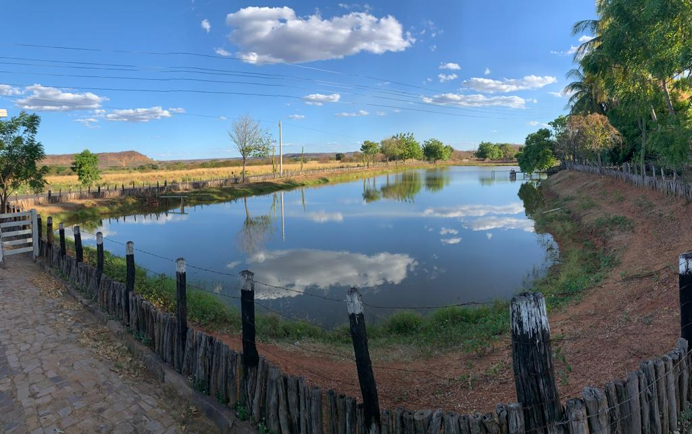
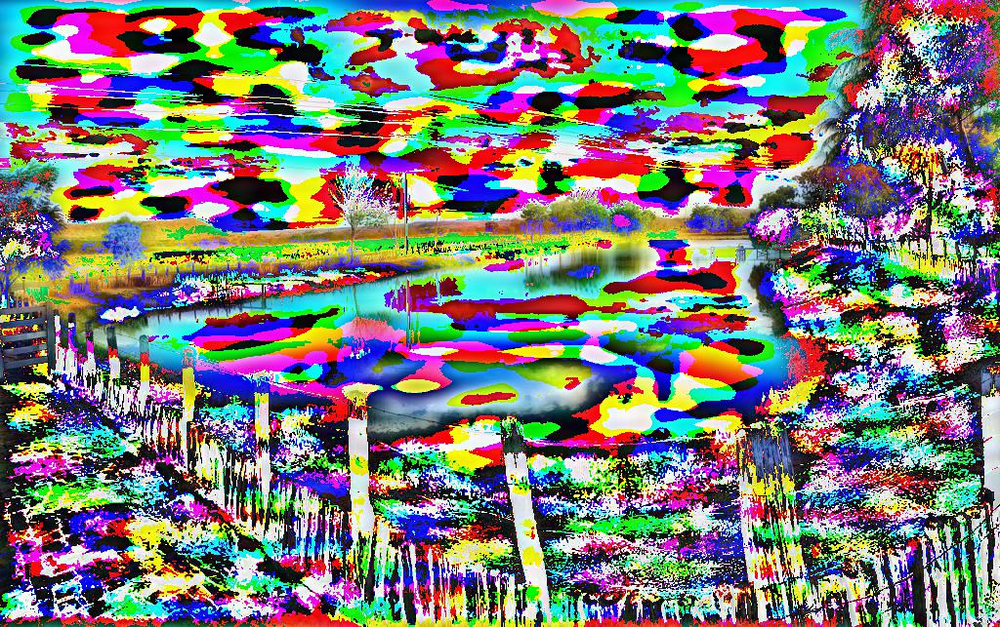

[](http://quantlet.de/)

## [](http://quantlet.de/) **DEDA_Image_Filter** [](http://quantlet.de/)

```yaml

Name of Quantlet : DEDA_Image_Filter

Published in : Digital Economy and Decision Analytics

Description : 'Create a filter with Fourier Transformation for a picture of a farm in Brazil.'

Keywords: fourier transformation, numpy, python, picture, brazil

Author: Alexandre Gomes Leitao

Submited: Fri, Nov 4 2022 by Alexandre G. Leitao

Datafiles: fazenda_1.jpg

```



