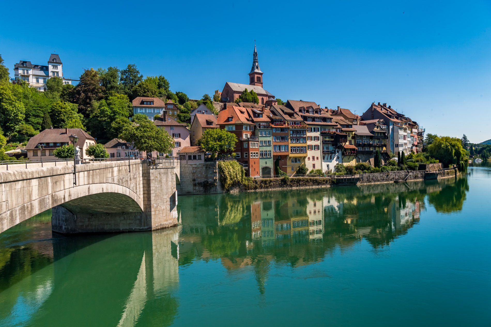

[](http://quantlet.de/)

## [](http://quantlet.de/) **Retro Laufenburg Picture** [](http://quantlet.de/)

```yaml

Name of Quantlet: "Retro Laufenburg Picture"

Published in: "SDA_2022_St_Gallen"

Description: "Creating a (retro) filter using Fourier Transformation for a picture of Laufenburg (Baden) old town"

Keywords: "Fourier Transformation, Filter, Picture, Fourier, Retro, Laufenburg"

Author: "Domenico Maffei"

Submitted: "04 November 2022"

Input: "Laufenburg.png"

Output: "Laufenburg_retro.png"

```



