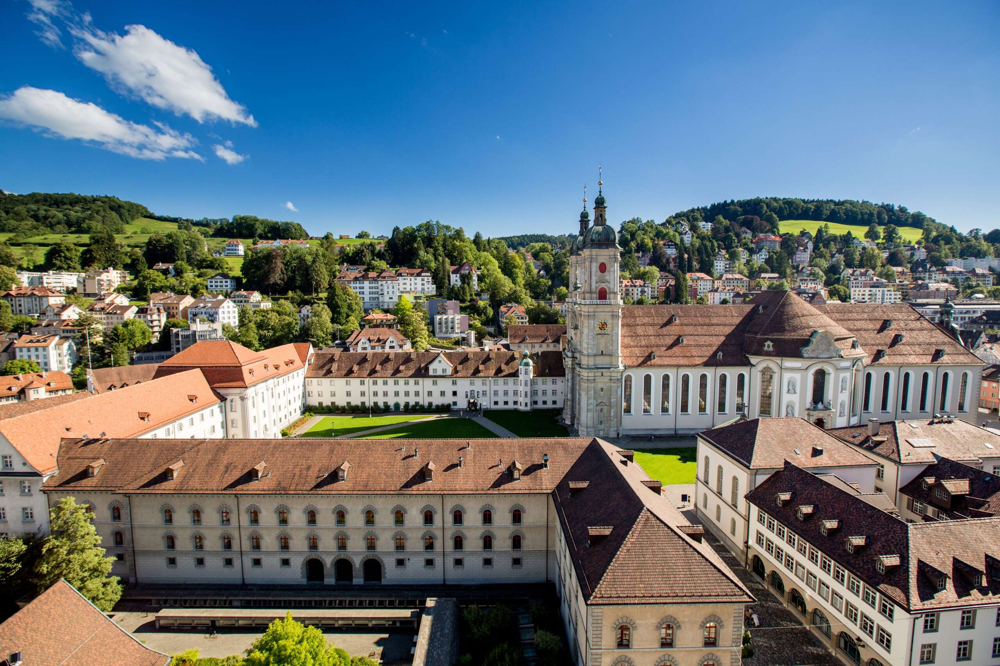

[](http://quantlet.de/)

## [](http://quantlet.de/) **StatisticsFinance_Unit5** [](http://quantlet.de/)

```yaml

Name of Quantlet : StatisticsFinance_Unit5
Published in : SDA_2022_St_Gallen
Description : Creating a filter using Fourier Transformation for a picture of St Gallen
Keywords :
- Fourier Transformation
- Filter
- Picture
- St Gallen
Author : Wen En Lim

```



### PYTHON Code
```python

#!/usr/bin/env python3
# -*- coding: utf-8 -*-
"""
Created on Fri Nov  4 16:12:10 2022

@author: wenenlim
"""

"""
Fourier Transformation
"""
from PIL import Image
from numpy.fft import fft,ifft
import numpy as np
# Open the image by using Python Imaging Library(PIL)
image_before=Image.open('stgallen_view.jpg')
# Decoding and encoding image to float number
image_int=np.fromstring(image_before.tobytes(), dtype=np.int8)
# Processing Fourier transform
fft_transformed=fft(image_int)
# Filter the lower frequency, i.e. employ a high pass
fft_transformed=np.where(np.absolute(fft_transformed) < 9e4,0,fft_transformed)
# Inverse Fourier transform
fft_transformed=ifft(fft_transformed)
# Keep the real part
fft_transformed=np.int8(np.real(fft_transformed))
# Output the image
image_output=Image.frombytes(image_before.mode, image_before.size, fft_transformed)
image_output.show()

```

automatically created on 2022-11-10