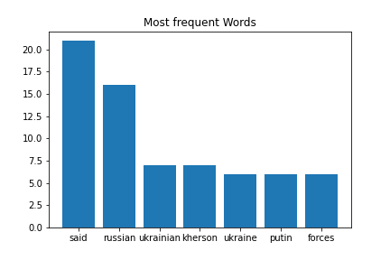
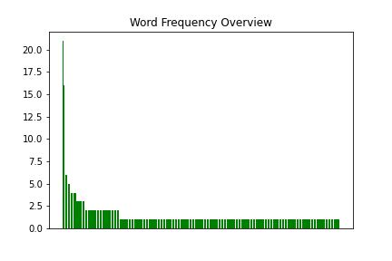
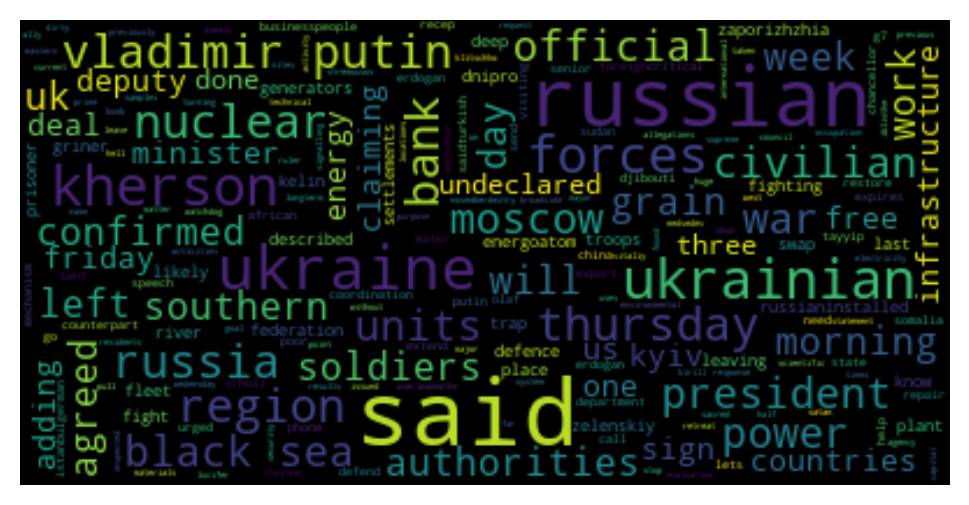

[](http://quantlet.de/)

## [](http://quantlet.de/) **SDA_2022_St_Gallen_Homework2** [](http://quantlet.de/)

```yaml

Name of Quantlet: 'SDA_2022_St_Gallen_Homework2'

Published in: 'SDA_2022_St_Gallen'

Description: 'Sentiment Analysis of the article "Russia-Ukraine war at a glance: what we know on day 254 of the invasion" from Guardian'

Keywords: 
- 'Ukraine war'
- 'Sentiment Analysis'
- 'Wordcloud'
- 'LDA'

Author: 'Valerie Lai'

Submitted: '04 November 2022'

```





