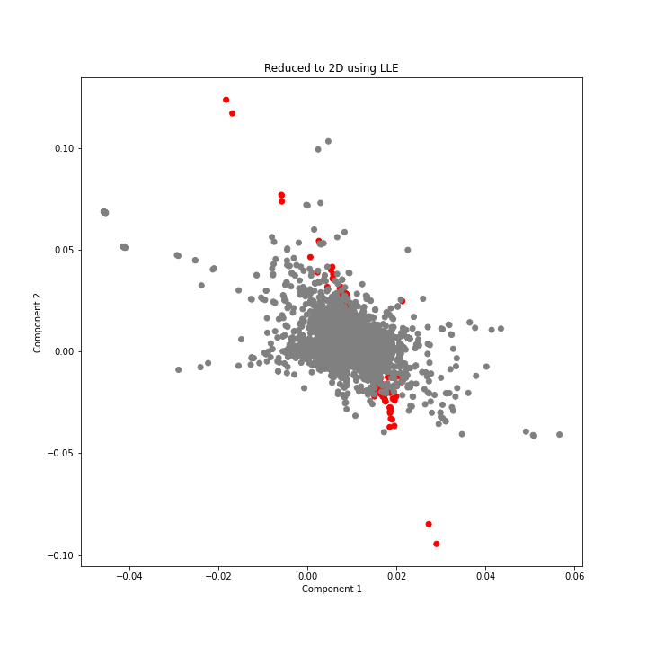
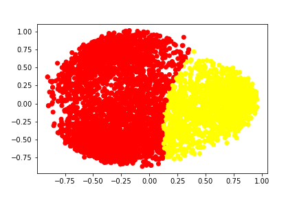

[](http://quantlet.de/)

## [](http://quantlet.de/) **SDA_2022_Wine_Discrimination_using_SC_and_LLE** [](http://quantlet.de/)

```yaml

Name of Quantlet: 'SDA_2022_Wine_Discrimination_using_SC_and_LLE'

Published in: 'SDA_2022_St_Gallen'

Description: 'Combining data on wine quality for white and red wine. Use PCA, Spectral Clustering and LLE to find out whether clusters can be determined from this joint data set.'

Keywords: 'Spectral Clustering, PCA, Locally Linear Embedings, Clusters, Principal Components, Wine'

Author: 'Alina Schmidt'

Submitted: '04 November 2022'

Input: 'winequality-red.csv, winequality-white.csv'

Output: 'Three plots depicting the Wine Discrimination processes'


```




