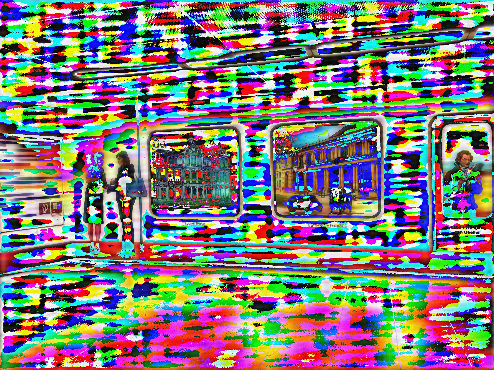

[](http://quantlet.de/)

## [](http://quantlet.de/) **Filter_PictureFrankfurt** [](http://quantlet.de/)

```yaml

Name of Quantlet: 'Filter_PictureFrankfurt'

Published in: 'SDA_2022_St_Gallen'

Description: 'Creating a filter using Fourier Transformation for a picture of the station Konstablerwache in Frankfurt'

Keywords: 'Fourier Transformation, Filter, Picture, Fourier, Frankfurt'

Author: 'Alina Schmidt'

Submitted: '03 November 2022'

Input: 'Konstablerwache_before.jpg'

Output: 'Konstablerwache_after.jpg'


```



### PYTHON Code
```python

# -*- coding: utf-8 -*-
"""
Created on Thu Nov  3 18:55:22 2022

@author: Alina Schmidt
"""


import os
from numpy.fft import fft,ifft
import numpy as np

# Change Working Directory
os.chdir("C:\\Users\Azer\Desktop\SDA")


# Upload before image using PIL
from PIL import Image
image_before=Image.open("Konstablerwache_before.jpg")
    
# Decoding and encoding image to float number
image_int=np.frombuffer(image_before.tobytes(), dtype=np.int8)
# Processing Fourier transform
fft_transformed=fft(image_int)
# Filter the lower frequency, i.e. employ a high pass
fft_transformed=np.where(np.absolute(fft_transformed) > 10e6,0,fft_transformed)
# Inverse Fourier transform
fft_transformed=ifft(fft_transformed)
# Keep the real part
fft_transformed=np.int8(np.real(fft_transformed))
# Output the image
image_output=Image.frombytes(image_before.mode, image_before.size, fft_transformed)
image_output.show()
image_output.save("Konstablerwache_after.jpg")

```

automatically created on 2022-11-06