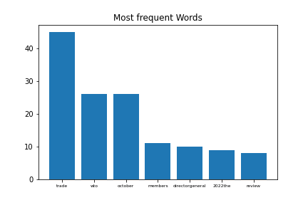
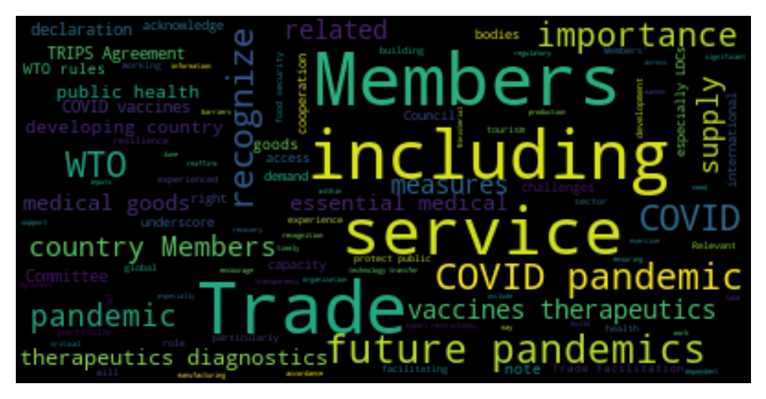

[](http://quantlet.de/)

## [](http://quantlet.de/) **WTO_News_SentimentAnalysis** [](http://quantlet.de/)

```yaml

Name of Quantlet: 'WTO_News_SentimentAnalysis'

Published in: 'SDA_2022_St_Gallen'

Description: 'Sentiment Analysis of the WTOs current news page as well as the response of WTO to Covid 19 Pandemic from 22/06/22'

Keywords: 'Sentiment Analysis, WTO, Covid19, Wordcloud, LDA'

Author: 'Alina Schmidt'

Submitted: '03 November 2022'

Input: 'Accessing URL of WTOs news page. Additionally, txt file of WTOs response to Covid 19 pandemic.'

Output: 'Overview of word frequency and most frequent words. Wordcloud. LDA model as txt file.'

```






### PYTHON Code
```python

# -*- coding: utf-8 -*-
"""
Created on Thu Nov  3 19:39:29 2022

@author: Alina Schmidt
"""


from selenium import webdriver
from webdriver_manager.firefox import GeckoDriverManager
import matplotlib.pyplot as plt
import re
import os
import pysentiment2 as ps


p = "C:/Users/Azer/Desktop/SDA"
os.chdir(p)


# Start Selenium
driver = webdriver.Firefox(executable_path=GeckoDriverManager().install())
# URL to current news of World Trade Organization
url = "https://www.wto.org/english/news_e/news_e.htm"

# Extract text
driver.get(url)
text = driver.find_element('id','mainContainer').text
driver.close()
driver.stop_client()


# Some expressions still left
# Differ between quotes!
expression = "[()]|(\“)|(\”)|(\“)|(\”)|(\,|\.|-|\;|\<|\>)|(\\n)|(\\t)|(\=)|(\|)|(\-)|(\')|(\’)"
cleantextCAP = re.sub(expression, '', text)
cleantext = cleantextCAP.lower()       

# Count and create dictionary
dat = list(cleantext.split())
dict1 = {}
for i in range(len(dat)):
    print(i)
    word = dat[i]
    dict1[word] = dat.count(word)
    continue
# length of dict1: 546


# Filter Stopwords
import nltk
nltk.download('stopwords')
from nltk.corpus import stopwords 
keys = list(dict1)
filtered_words = [word for word in keys if word not in stopwords.words('english')]
dict2 = dict((k, dict1[k]) for k in filtered_words if k in filtered_words)
# length of dict2: 501

#keys in stopwords.words("english")

# Resort in list
# Reconvert to dictionary

def valueSelection(dictionary, length, startindex = 0): # length is length of highest consecutive value vector
    
    # Test input
    lengthDict = len(dictionary)
    if length > lengthDict:
        return print("length is longer than dictionary length");
    else:
        d = dictionary
        items = [(v, k) for k, v in d.items()]
        items.sort()
        items.reverse()   
        itemsOut = [(k, v) for v, k in items]
    
        highest = itemsOut[startindex:startindex + length]
        dd = dict(highest)
        wanted_keys = dd.keys()
        dictshow = dict((k, d[k]) for k in wanted_keys if k in d)

        return dictshow;
    
dictshow = valueSelection(dictionary = dict2, length = 7, startindex = 0)

# Save dictionaries for wordcloud
text_file = open("WTO_News.txt", "w")
text_file.write(str(cleantext))
text_file.close()


# Plot
n = range(len(dictshow))
plt.bar(n, dictshow.values(), align='center')
plt.xticks(n, dictshow.keys(),fontsize=6)
plt.title("Most frequent Words")
plt.savefig("plot_MostFrequentWords_WTO_News.png", transparent=True)

# Overview
# len(dict2) :520; set length < 520
overview =  valueSelection(dictionary = dict2, length = 500, startindex = 0)
nOverview = range(len(overview.keys()))
plt.bar(nOverview, overview.values(), color = "g", tick_label = "")
plt.title("Word Frequency Overview")
plt.xticks([])
plt.savefig("plot_WordFrequencyOverview_WTO_News.png", transparent=True)


# Sentiment Analysis
hiv4 = ps.HIV4()
tokens = hiv4.tokenize(cleantext)
score = hiv4.get_score(tokens)
print(score)

text_file = open("Output_score_WTO_News.txt", "w")
text_file.write(str(score))
text_file.close()

# Polarity
# Formula: (Positive - Negative)/(Positive + Negative)

# Subjectivity
# Formula: (Positive + Negative)/N


#####--------------- Part 2 : Custom Word Cloud --------------- #####
# Wordcloud

from wordcloud import WordCloud


# Read the whole text.
text = open(os.path.join(p, 'WTO_ResponseCovid19.txt')).read()


# Generate a word cloud image
wordcloud = WordCloud().generate(text)

# Display the generated image:
# the matplotlib way:
import matplotlib.pyplot as plt
plt.imshow(wordcloud, interpolation='bilinear')
plt.axis("off")
plt.show()
#plt.savefig("plot_Wordcloud.png", bbox_inches='tight',dpi=200,pad_inches=0.0)

# lower max_font_size
wordcloud = WordCloud(max_font_size=40).generate(text)
plt.figure()
plt.imshow(wordcloud, interpolation="bilinear")
plt.axis("off")
#plt.show()
plt.savefig("plot_Wordcloud_WTO_ResponseCovid.png", bbox_inches='tight',dpi=200,pad_inches=0.1)


#####--------------- Part 3 : Latent Dirichlet Allocation (LDA) --------------- #####


text = open(os.path.join(p, 'WTO_ResponseCovid19.txt')).read()
doc_l = str.split(text)
doc_l.pop()[0]

doc_complete = doc_l

doc_out = []
for l in doc_complete:
    
    cleantextprep = str(l)
    
    # Regex cleaning
    expression = "[^a-zA-Z ]" # keep only letters, numbers and whitespace
    cleantextCAP = re.sub(expression, '', cleantextprep) # apply regex
    cleantext = cleantextCAP.lower() # lower case 
    bound = ''.join(cleantext)
    doc_out.append(bound)


doc_complete = doc_out


import nltk
nltk.download('stopwords')
nltk.download('wordnet')
nltk.download('omw-1.4')
from nltk.corpus import stopwords 
from nltk.stem.wordnet import WordNetLemmatizer
import string
stop = set(stopwords.words('english'))
stop.add('going')
stop.add('know')
exclude = set(string.punctuation) 
lemma = WordNetLemmatizer()
def clean(doc):
    stop_free = " ".join([i for i in doc.lower().split() if i not in stop])
    punc_free = ''.join(ch for ch in stop_free if ch not in exclude)
    normalized = " ".join(lemma.lemmatize(word) for word in punc_free.split())
    return normalized


doc_clean = [clean(doc).split() for doc in doc_complete]    


# Importing Gensim
import gensim
from gensim import corpora

# Creating the term dictionary of our courpus, where every unique term is assigned an index.
dictionary = corpora.Dictionary(doc_clean)

# Converting list of documents (corpus) into Document Term Matrix using dictionary prepared above.
doc_term_matrix = [dictionary.doc2bow(doc) for doc in doc_clean]


# Creating the object for LDA model using gensim library
Lda = gensim.models.ldamodel.LdaModel

# Running and Trainign LDA model on the document term matrix.
ldamodel = Lda(doc_term_matrix, num_topics=3, id2word = dictionary, passes=20)


print(ldamodel.print_topics(num_topics=3, num_words=10))

text_file = open("Output_LDAmodel_WTO_ResponseCovid.txt", "w")
text_file.write(str(ldamodel.print_topics(num_topics=3, num_words=10)))
text_file.close()

```

automatically created on 2022-11-06